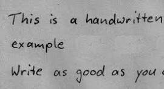

# HandwrittenTextRecognitionUsingOpencvandTesseract

## Overview
This project focuses on recognizing handwritten text using OpenCV and Tesseract OCR. It processes images of handwritten text and converts them into machine-readable text. The main goal is to automate the extraction of text from scanned documents, notes, and other handwritten content.

## Features
- Preprocessing of images using OpenCV techniques such as thresholding, noise removal, and contour detection.
- Optical Character Recognition (OCR) using Tesseract to extract text from images.
- Ability to handle different handwriting styles and formats.
- Integration with Jupyter Notebook for experimentation and model fine-tuning.

## Sample Images
Below are some example images used for training and testing:

  
  
  

## Installation & Usage
1. Clone this repository:
   ```bash
   git clone https://github.com/Srinivasareddyseelam/HandwrittenTextRecognitionUsingOpencvandTesseract
   ```
2. Install dependencies:
   ```bash
   pip install -r requirements.txt
   ```
3. Run the Jupyter notebook to train and test the model.
   ```bash
   jupyter notebook Handwritten_Text_Recognition.ipynb
   ```

## Dataset
The project uses a dataset containing various handwritten samples for training and evaluation. The dataset consists of multiple handwritten text images with different writing styles to improve accuracy.

## Technologies Used
- **OpenCV**: For image processing, noise reduction, and feature extraction.
- **Tesseract OCR**: For character recognition and text extraction.
- **Python**: For scripting and automation.
- **Jupyter Notebook**: For developing and testing the recognition pipeline.

## Applications
- Automated text extraction from handwritten notes.
- Digitization of historical manuscripts and documents.
- Assisting visually impaired individuals by converting handwriting into speech.

## Contributors
Srinivasa Reddy Seelam

